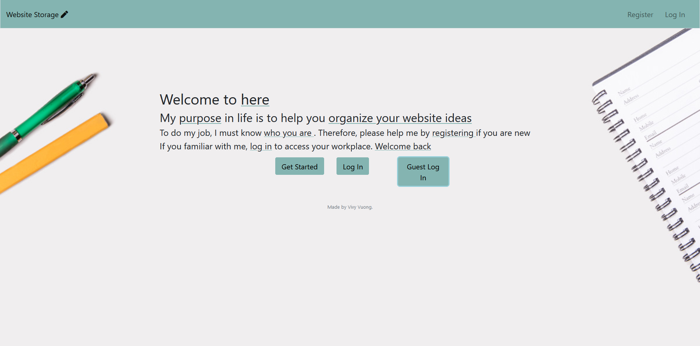
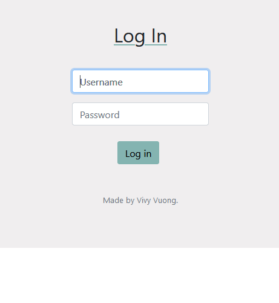
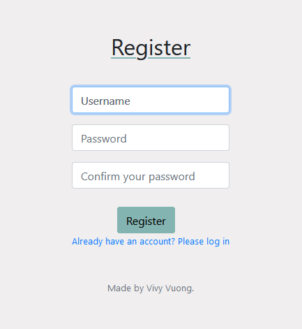
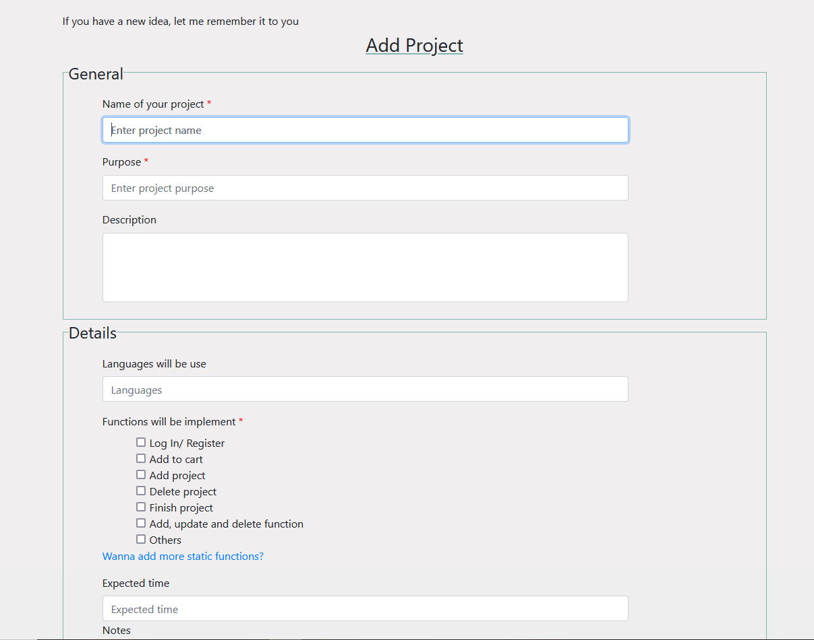
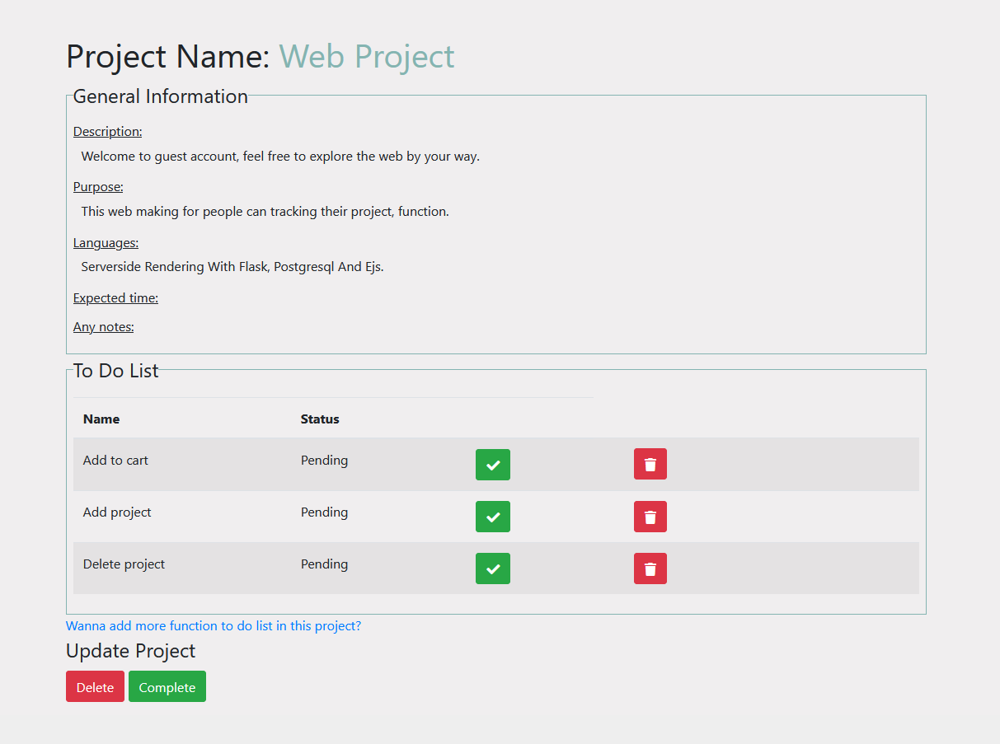

# Website Storage - Record Your Website Idea

# Website Address (Hosted by Heroku)
https://websitestorage.herokuapp.com/
  
# Usage:
    1. Create new, delete or finish projects
    2. Keep track your project's progress by recording each function done
    3. Keep track your number of done project and currently working projects

# Showcase:

## Landing Page

## Login && Register

## Homepage(Signed In)

## Form (Add A New Project)

## Detail Page

